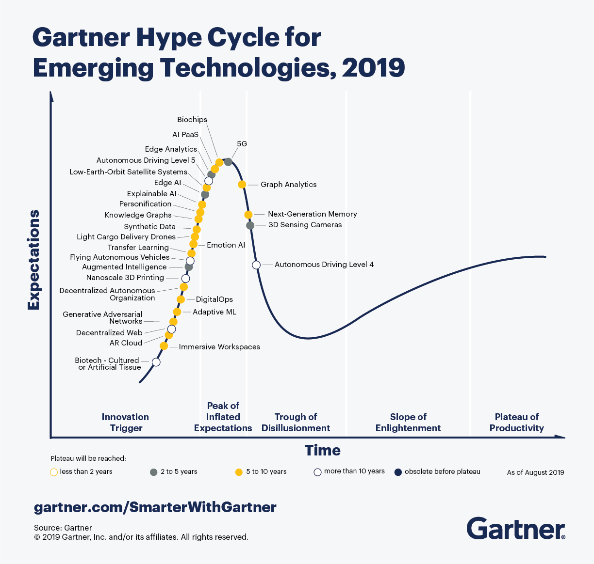

# IT в научных исследованиях

Программа для аспирантов института физики, нанотехнологий и телекоммуникаций Политехнического университета Санкт-Петербурга.

## Инструменты и технологии (2019)

1. Оформление результатов. 

   - Язык TeX/LaTeX, редактор LyX, редактор Visual Studio Code + LaTeX Workshop, редактор Sublime Text 2 + плагины, редактор Atom + плагины, сервис Overleaf, сервис StackEdit, сервис Authorea, Latexit, шаблоны на сайте latextemplates.com. 
   - Язык Markdown, язык MathML, редактор Typora, Pandoc . 
   - Системы контроля версий git.
   - Сервис substance.io

2. Библиография. 

   - Zotero, Mendeley, BibDesk, JabRef, Citavi, Papers.

   - Сервис препринтов ArXiv.org, 
   - Проблема copyright и сервис sci-hub.
   - Сервис Google Scholar, сервис SciRate, сервис peerlibrary, сервис paperscape.org, Microsoft Academic, wizdom.ai, Scopus.
   - Наукометрические индексы.

3. Публикация кода.

   - Сервис GitHub, сервис BitBucket, сервис GitLab.
   - Сервис оформления кода Carbon.

4. Слайды. 

   - Beamer (LaTeX), PowerPoint, Keynote, Google Slides, OpenOffice Impress, slidify, Shower Presentation Engine.
   - Сервис Prezi, сервис Deckset, сервис Zoho.

5. Визуализация.

   - Matplotlib (Python), Origin, Wolfram Mathematica, Matlab, Gnuplot, D3.js (javascript), ggplot (R), Tikz (LaTeX), сервис draw.io, Inkscape.

6. Образование. 

   - Google Classroom, Moodle, Edmodo.
   - Сервисы MOOC: Stepik, edX, Coursera, Открытое образование.
   - Методология computational thinking.

7. Заметки, анализ информации, управление временем.

   - Evernote, Onenote, TiddlyWiki, Google Docs.
   - Mind map. Freemind, mindmeister.com, coggle.it.
   - Техники Promodora, GTD, диаграмма Ганта. 

8. Вычисления и анализ данных.

   - Python + Libs + JupyterLab, Wolram Mathematica, Matlab, Maple, Sage, Octave, R, Julia, Maxima.
   - Pandas (Python), SciKit (Python), PyTorch, Tensorflow, R.

Дополнительно: [Digital tools for researchers](http://connectedresearchers.com/online-tools-for-researchers/)

### Тренды (2019)

- Autonomous things
- Augumented analytics
- AI-DrivenDevelopment
- Digital Twins
- Empowered Edge
- Immersive Technologies
- Blockchain
- Smart Spaces
- Digital Ethics and Privacy
- Quantum Computing

Источник: [5 Trends Appear on the Gartner Hype Cycle for Emerging Technologies, 2019](https://www.gartner.com/smarterwithgartner/5-trends-appear-on-the-gartner-hype-cycle-for-emerging-technologies-2019/)
